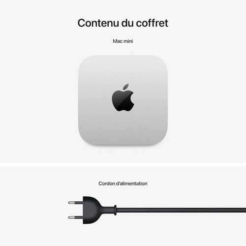

# 🔦 pidog-patrol

**Mode patrouille pour le robot chien SunFounder PiDog.**
Il explore, évite les obstacles, décrit ce qu'il voit — et s'arrête dès qu'on le touche.

Capteurs pour marcher, caméra et IA pour comprendre. Les deux ne jouent pas le même rôle,
et c'est tout l'intérêt.

---

## Trois couches, trois vitesses

| Couche | Cadence | Rôle | Peut arrêter le robot ? |
|---|---|---|---|
| **Sécurité** | ~200 ms | tactile, inclinaison, batterie, durée | ✅ immédiatement |
| **Réflexe** | chaque cycle | ultrason filtré → avancer ou tourner | ✅ |
| **Vision** | ~45 s | décrit la scène, rend prudent | ❌ jamais bloquante |

**La navigation ne dépend jamais de l'IA.** Mesuré sur un Mac M2 Pro : `qwen3-vl:8b`
met **26 à 36 secondes** par image. Confier des pattes à une décision aussi lente serait
absurde. La vision tourne dans un thread séparé, la marche continue sans l'attendre.

### L'invariant de sécurité

> **La vision peut rendre le robot prudent. Elle ne peut jamais l'autoriser à passer.**

Si l'IA dit « voie libre » alors que l'ultrason voit un mur à 20 cm, le robot tourne.
L'inverse est permis : si l'ultrason ne voit rien mais que la caméra repère des câbles
au sol, le robot évite. C'est le cas réel qui a motivé cette règle — un ultrason ne
détecte pas un câble, une caméra si.

Cet invariant est couvert par un test automatique.

---

## Installation

```bash
git clone https://github.com/koua29/pidog-patrol.git
cd pidog-patrol
python3 tests/test_decision.py      # 10 tests, aucun matériel requis
python3 patrol.py --verifier
```

Réglez l'adresse de votre serveur Ollama dans `config.json` (`vision.hote`).

### Intégration à pidog-voice (optionnel)

```bash
./install/integrer_pidog_voice.sh ~/script/pidog-voice
```

*« PiDog, patrouille »* lancera alors cette patrouille à la place de celle, rudimentaire,
intégrée à [pidog-voice](https://github.com/koua29/pidog-voice). Pour revenir en arrière :
`./install/integrer_pidog_voice.sh --retirer`.

---

## Utilisation

```bash
PIDOG_MARCHE=1 python3 patrol.py                # patrouille (5 min par défaut)
PIDOG_MARCHE=1 python3 patrol.py --duree 120    # 2 minutes
PIDOG_MARCHE=1 python3 patrol.py --sans-vision  # capteurs seuls, aucun réseau requis

python3 patrol.py --capteurs      # affiche les capteurs en continu, sans bouger
python3 patrol.py --simulation    # déroule TOUTE la logique sans bouger les servos
python3 patrol.py --verifier      # valide la config et l'environnement
```

### 🚨 `PIDOG_MARCHE=1` est obligatoire

Sans cette variable, la patrouille **refuse de démarrer**. Un PiDog passe le plus clair
de son temps sur un bureau, et une patrouille lancée là finit par une chute. La valeur
sûre est donc le refus, et l'autorisation doit être explicite.

Pour valider la logique sans risque, `--simulation` déroule la boucle complète —
décisions, sécurité, vision — sans bouger un seul servo.

---

## Arrêt

| Moyen | Délai |
|---|---|
| **Main sur la tête** | immédiat |
| Inclinaison > 35° (chute, robot soulevé) | immédiat |
| Batterie sous 6,8 V | au cycle suivant |
| Durée maximale atteinte | au cycle suivant |
| `Ctrl-C` ou `pkill -f patrol.py` | arrêt propre, GPIO libéré |

Le gestionnaire de signaux n'est pas un détail : `Pidog()` lance des threads non-daemon.
Sans lui, un `SIGTERM` laisse le processus vivant **et le GPIO verrouillé**, ce qui fait
échouer silencieusement tous les lancements suivants — l'ultrason renvoie alors `-1`
en permanence et le robot se croit aveugle.

---

## Configuration

Tout est dans `config.json`.

| Réglage | Défaut | Rôle |
|---|---|---|
| `obstacle.seuil_cm` | 40 | Distance à laquelle il tourne |
| `obstacle.mesures_par_controle` | 5 | Mesures dont on prend le **minimum** |
| `obstacle.pas_par_cycle` | 2 | Pas entre deux contrôles |
| `obstacle.rotation_pas` → `_max` | 3 → 7 | La rotation s'allonge s'il insiste |
| `blocage.cycles_avant_demi_tour` | 4 | Cycles d'avance sans progrès = coincé |
| `blocage.cycles_sans_echo` | 6 | Cycles sans écho avant de tourner par prudence |
| `securite.inclinaison_max_deg` | 35 | Au-delà : chute ou robot soulevé |
| `securite.batterie_min_v` | 6.8 | Sous ce seuil, la patrouille s'arrête |
| `securite.duree_max_s` | 300 | Durée maximale d'une patrouille |
| `vision.active` | true | `false` = capteurs seuls |
| `vision.intervalle_s` | 45 | Cadence d'analyse (le modèle met ~30 s) |
| `vision.influence_navigation` | true | La vision peut faire tourner le robot |
| `vision.annoncer_scene` | true | Il dit à voix haute ce qu'il voit |

---

## Pourquoi le minimum, et pas la moyenne

Le capteur ultrason est monté **sur la tête**. Chaque pas fait tanguer le corps, le
faisceau part au plafond et renvoie des échos parasites. Face au même mur :

```
à l'arrêt   : 68 cm, écart-type < 1 cm
en marchant : 60 … 155 cm
```

Les parasites sont **toujours plus longs** que la vraie distance — un obstacle ne peut
pas être plus loin qu'il n'est. On garde donc le **minimum** de 5 mesures. Une moyenne
ou une médiane laisserait passer un « mur à 120 cm » qui n'existe pas, et le robot
foncerait dedans.

Après filtrage, l'approche d'un mur donne une décroissance propre : 57 → 50 cm.

## Ce que la caméra apporte vraiment

Un exemple réel, en conditions de patrouille :

> *« La scène montre une pièce sombre avec un bureau à gauche et des câbles au sol,
> bloquant le chemin vers l'avant. »* → `voie_libre: false`, `conseil: droite`

L'ultrason voyait 161 cm de dégagement. Les câbles au sol lui sont invisibles — trop
fins, trop bas. C'est exactement le genre de piège dans lequel un robot chien s'emmêle.

**Modèles testés :** `qwen3-vl:8b` — 26 à 36 s, descriptions justes, retenu.
`moondream:1.8b` — 4 s mais réponses tronquées ou vides, **inutilisable**.
Piège à connaître : `qwen3-vl` est un modèle à raisonnement. Avec `think=False` il
renvoie un contenu **vide** ; avec un budget de tokens trop court, tout part dans le
champ `thinking` et `content` reste vide (`done_reason=length`). Il lui faut de la marge.

---

## Cohabitation avec pidog-voice

Deux objets `Pidog()` dans deux processus se disputent le GPIO (`lgpio.error: GPIO busy`),
et l'échec est **silencieux** : l'ultrason et le tactile renvoient des valeurs mortes.

`patrol.py` suspend donc l'écoute vocale au démarrage et la relance à la fin.
[pidog-energy](https://github.com/koua29/pidog-energy), lui, cohabite sans problème :
il lit la batterie par l'ADC et n'instancie jamais `Pidog()`.

---

## 🤝 Le matériel du projet

*Liens partenaires Amazon : si vous achetez via ces liens, le projet touche une petite
commission, sans surcoût pour vous. Ce sont les machines sur lesquelles ce code a été
développé et testé.*

<table>
<tr>
<td align="center" width="33%">
  <a href="https://link.amazon/B0bYWa5Tm"></a><br>
  <b>SunFounder PiDog</b><br><sub>Le robot chien</sub>
</td>
<td align="center" width="33%">
  <a href="https://link.amazon/B0jdCWkVR"></a><br>
  <b>Raspberry Pi 4</b><br><sub>Le corps — capteurs et réflexes</sub>
</td>
<td align="center" width="33%">
  <a href="https://link.amazon/B0bhYDJWI"></a><br>
  <b>Apple Mac Mini</b><br><sub>La vision — Ollama et qwen3-vl</sub>
</td>
</tr>
</table>

## ☕ Offrez-moi un café

Ce projet est gratuit et open source. S'il vous est utile, vous pouvez me remercier
en m'offrant un café — il suffit de scanner ce QR code PayPal. Merci beaucoup ! 🙏

<p align="center">
  
</p>

## La famille PiDog

- **[pidog-voice](https://github.com/koua29/pidog-voice)** — commande vocale française
- **[pidog-energy](https://github.com/koua29/pidog-energy)** — surveillance de batterie
- **pidog-patrol** — vous êtes ici

## Licence

[MIT](LICENSE) © 2026 koua29
